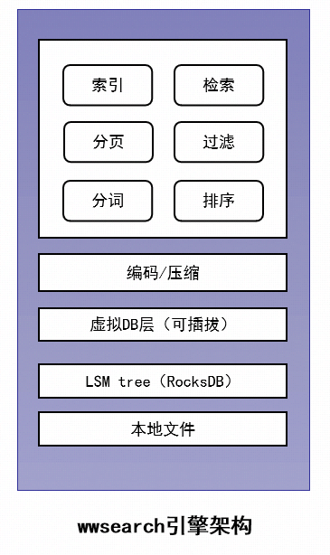
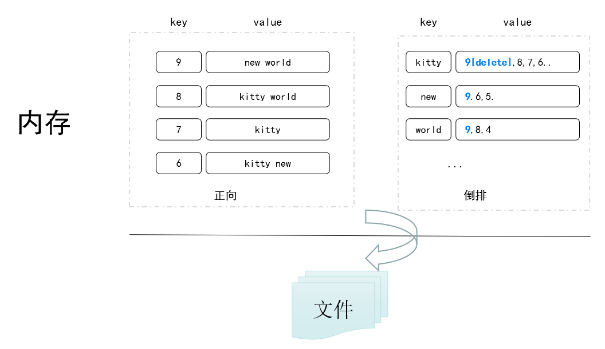
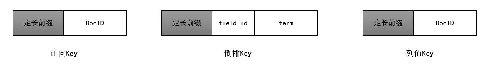
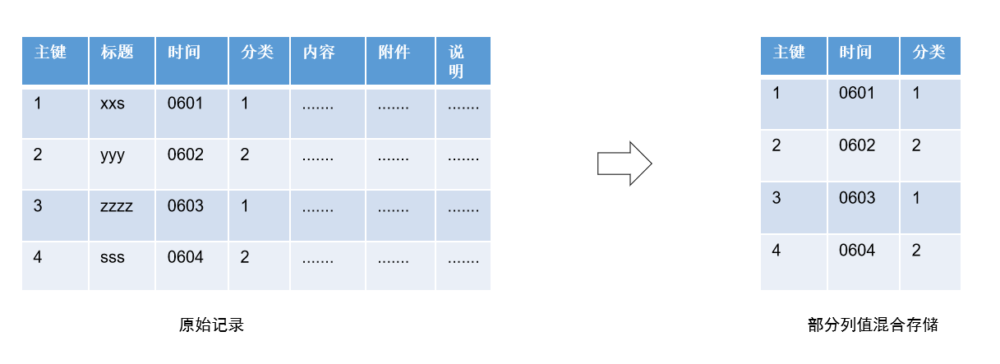
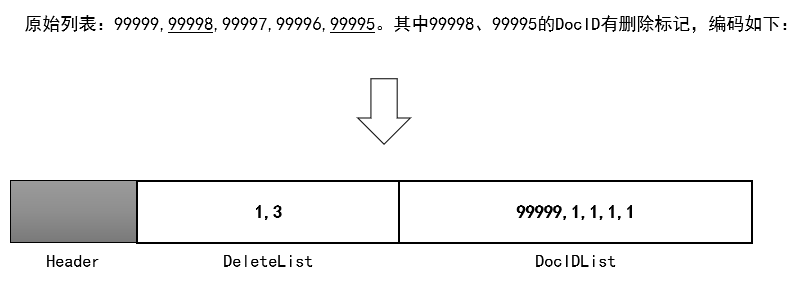

# wwsearch 全文检索引擎

#### 背景

企业微信作为典型企业服务系统，其众多企业级应用都需要全文检索能力，包括员工通讯录、企业邮箱、审批、汇报、企
业CRM、企业素材、互联圈子等。下图是一个典型的邮件检索场景。


由于过去几年业务发展迅速，后台检索架构面临挑战：
1\. 系统在亿级用户，xxx万企业下，如何高效+实时地检索个人企业内数据和所在企业全局数据。
2\. 业务模型众多，如何满足检索条件/功能多样化需求。
3\. 数据量庞大，检索文本几十TB，如何节约成本。

业界有被广泛使用的开源全文检索引擎，比如：lucene、sphinx等。它们适用于站内检索的场景。而在海量用户、大规模数据量的实时检索场景下，存在明显缺点：
1\. 无法支持细粒度切分索引，只能对全局数据构建索引 ，检索过程需要过滤冗余数据。
2\. 不支持实时检索，有几十秒~分钟级延迟。
3\. 实际部署机型要求高，需要大内存机型才能支撑T级别的数据存储。

针对已有方案的不足，并结合企业级应用场景，我们重新设计和实现一套通用的全文检索引擎wwsearch。

#### 自研全文检索引擎

wwsearch为海量用户下的全文快速检索而设计，底层支持可插拔的lsm tree存储引擎，具备支持按用户的亿级分表、低延时、高效更新、索引压缩、功能丰富、内存消耗低等特点。

目前覆盖企业微信所有在线检索场景， 最大业务场景有300亿+条记录，索引词项万亿+，存储容量几十TB。在大规模数据下，服务运行稳定，可以为业务增长提供稳定有力保障！



wwsearch有丰富的功能，可灵活支持业务场景：
1\. 支持等值、前缀、模糊匹配，支持And、Or条件组合。
2\. 实时增删查改。
3\. 支持后置过滤，包括等值、数值范围、数组元素查找、字符串模糊匹配。
4\. 支持多条件排序，类似order by语义。
5\. 可扩展功能，包括聚合功能（sum/avg...）、文档打分。

####  高效索引更新

企业级应用相关的数据通常需要经过多次流转，才能达到最终状态，比如审批业务。这意味着，检索系统的数据写入后也需要部分更新。

开源检索引擎实现是基于文档粒度对索引进行增删，更新是一次删除和全量插入过程，无法高效支持部分更新。

wwsearch的实现和开源不同，索引的增删是基于词级别的，粒度更细。主要原理：
1\. 引擎记录写入文档的分词列表，更新时，通过对比更新前后的分词列表，可以知道应该插入哪些词、删除哪些词。
2\. 检索一个词的倒排列表时，会读取该词多个倒排列表，并按优先级对倒排列表归并，时间上后写的倒排列表优先级更高。
3\. 倒排列表内被删除的DocID会随着lsm tree文件的合并（Compact），会被逐渐淘汰。



wwsearch以倒排列表为单位对索引进行增删改的方案，优点如下：
1\. 实时读写，写入即可检索。
2\. 更新友好，高效支持部分更新。

#### 支持亿级分表

开源检索引擎对全局数据构建索引，每次检索需在全局索引中检索结果，这种做法存在缺点：
1\. 用户或企业只检索自身数据，在多用户场景下，检索效率低。
2\. 大规模数据情况下，无法实时响应用户请求。

通过支持细粒度分表的能力，wwsearch可以很好地解决这个问题。原理是：利用lsm tree全局有序能力，通过对正向索引、倒排索引的数据key增加特定Prefix的方式，来支持亿级分表的能力。由于底层存储采用lsm tree结构存储，通过共享key前缀方式，我们可以忽略不计这个Prefix增加的存储消耗。



wwsearch支持细粒度分表，优点如下：
1\. 检索性能最优、请求延时低。
2\. 无需过滤冗余数据，资源消耗最小，服务能保持很强的稳定性。

#### 全文模糊匹配

模糊匹配是在有限信息情况下找到匹配的文本。这是一个比较常见的功能需求，比如用户检索一个用户的手机号，输入前几个数字后，希望能尽快补全，又比如输入航班号数字部分，检索出完整航班号信息。

开源实现的不同方案：
1\. 对词进行细粒度切分，一个长度为N个字符的词，从该词切分出连续2个字、3个字... 一直到N个字的的词。这种方法缺点是有O(N^2)个词展开。
2\. 维护词典，在模糊匹配时，遍历词典找到满足匹配的词。这种方法缺点是匹配效率差，词典过大情况下，无法实时返回结果。

wwsearch用一种空间相对节省且检索高效的新方案：词按后缀展开+索引按词典排序+前缀匹配检索。通过例子描述，假设有记录DocID = 1，name = Michael。我们把name这个词按后缀展开后，以下词的倒排列表都会插入这个DocID。检索 **chae** 时，通过前缀匹配找到 **chael** 这个词的倒排列表，并把这个DocID返回。

``` C++
词典：
ael：1
chael：1   <--- 定位到这里
el: 1
hael：1
ichael：1
Michael：1
```

#### 高效过滤排序

部分业务场景里，单纯按关键词检索还不能满足用户需求：
1\. 命中结果需要特定排序，比如有些场景需要按时间倒序排列，有些场景需要按点击数再按时间倒序排列。
2\. 命中结果包含多余数据，还需要进行二次过滤，比如用户想检索处于申请中的审批单据。

这些需求需要读取排序列或者过滤列的属性值，行存和列存各有优缺点：
1\. 属性混合存储：这种方式无差别的把所有属性混合为一行记录，打包存储在文件里。好处是没有冗余存储，读取一次就可获得一条记录所有的列值。设想一个场景，一条文本原文大小6 KB，检索某个词命中1万条记录，需要排序返回。以此推算，对1万条记录排序一次，需要读取60MB数据。
2\. 属性按列存储：这种方式适用于宽列但列值比较稀疏的数据场景，可以按列独立操作。也有一些缺点，写入时需要写多列，读取时也要按排序或过滤情况读取多列。



过滤、排序的列通常都是数值类数据，如果能一次写入或读取应该是最优的。综上，wwsearch引擎采用部分属性混合存储的方案。优点：读取次数少，只需一次读取即可得到所需属性，配合批量读取，可以有效降低IO消耗。

#### 索引压缩

有效地降低检索系统存储容量消耗，可以降低机器运营成本。wwsearch引擎在以下多个方面对存储消耗进行针对性优化。

1\. 支持覆盖写功能。针对文本只写不改的场景，比如单据内容、邮件等，写入倒排索引后，正向索引不会存储分词后的词列表。通过这种接口写入场景，可以大幅度减少正向信息存储带来的消耗。

2\. 支持倒排列表压缩。倒排列表存储由三部分组成：头部（Header）、倒排列表（DocIDList）、删除列表（DeleteList）。头部记录编码版本，定长为1字节。倒排列表按DocID倒序，第一个是Base，后续每个值记录与前一个DocID差值，用varint编码。删除列表记录有删除标记的DocID位置（相对于倒排列表），按位置升序，第一个是Base，后续每个值记录与前一个位置差值，用varint编码。



3\. 支持主键映射。实际情况下业务主键通常是字符串，难以要求有64位无符号整数的主键，即使存在，其DocID在随机生成情况下，倒排列表的压缩方案就无法发挥很大作用。通过主键映射，任意业务主键可映射到一个唯一的64位无符号整数，从0开始，严格递增，映射可逆。
